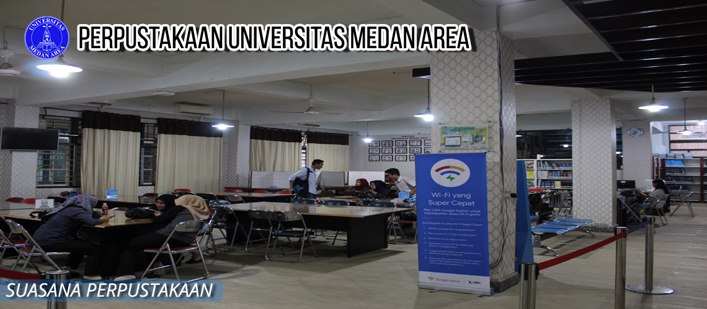
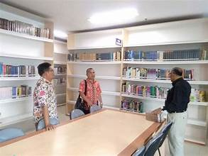

<!DOCTYPE html> 
<html>
<head>
	<title> Profil Perpustakaan UMA</title>
</head>
</body>

<b><head><tittle>Tugas Modul 1(1) Pemograman Web Praktik</tittle></head></b>

<body>

Nama: Aulika Dwi Priscilla

Nim: 210709023

 
 

Profil Perpustakaan UMA:

<b>1. Perpustakaan UMA</b>

<a href="https://perpustakaan.uma.ac.id/">
    &emsp;

&emsp;Perpustakaan Universitas Medan Area memilik 2 Pusat Perpustakaan dan 8 Perpustakaan cabang. Perpustakaan pusat 1 berlokasi di sebelah barat mesjid taqwa UMA. Perpustakaan Pusat yang kedua berlokasi di Jl. Setia Budi No.79B, Tj. Rejo, Medan, begitupun Perpustakaan Pascasarjana berada di alamat 
    yang dimaksud, lokasinya dipusat gedung perkuliahan mahasiswa program master dan doktor. Sementara perpustakaan cabang berada disetiap fakultas, diantaranya : Teknik, Pertanian, Ekonomi dan Bisnis, Hukum, Ilmu Sosial dan Ilmu Politik, Psikologi dan Biologi. Selain itu, Perpustakaan Pusat Islam yang berada didalam mesjid UMA. Secara keseluruhan koleksi Universitas Medan Area sebanyak 17.490 judul, dan 36.944 eksemplar terdiri dari buku teks, e-book, jurnal, undang-undang, fiksi, kamus, koleksi kuno, al-quran, bulletin, buku panduan, atlas, buku ajar, almanac, referensi electronic resource, e-magazine, e-prociding dan cd-rom.

    </a>

Profil Perpustakaan UMSU:

<b>2. Perpustakaan UMSU</b>

<a href="https://perpustakaan.umsu.ac.id/">
    &emsp;

&emsp;Atas bantuan dari H. Probo Sutedjo selaku dewan kurator UMSU Medan, berdirilah kampus III yang terletak di Jalan Kapten Muchtar Basri, BA No. 3 (Kampus Mercubuana) dengan luas bangunan ± 2 hektar. Pada tahun 1992 kampus III UMSU diresmikan pemakaiannya oleh Menteri Penerangan Harmoko yang sekaligus meresmikan tiga unit gedung yaitu gedung Rektorat, gedung Fakultas Ekonomi dan gedung Fakultas Hukum yang tergabung dengan Fakultas Isipol serta Rektorat UMSU Medan yang semula berada pada kampus I pindah ke kampus III.
    Perpustakaan UMSU mulanya telah berdiri di lingkungan kampus I sejak tahun 1957 tepatnya pada tanggal 17 Februari bersamaan dengan berdirinya Fakultas Filsafat. Sebagaimana yang telah diuraikan di atas, oleh karena meningkatnya jumlah manusia yang mendaftar ke UMSU Medan dimulai pada tahun 1982, pusat penyelenggaraan akademik UMSU Medan yang sebelumnya berada pada kampus I pindah ke kampus III termasuk gedung Rektorat UMSU Medan.

    <section>

<audio controls width="300" height="200">
<source src="Abdul & The Coffee Theory - Happy Ending.mp3">
</audio>

        <video controls width="300" height="200">
            <source src="video_UMSU.mp4" type="video/mp4">
        </video>
</html>
